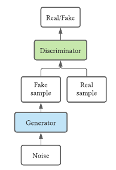
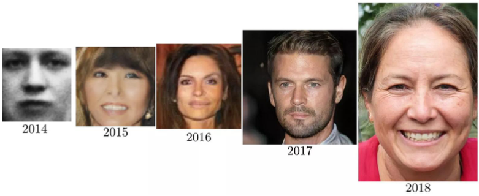

# Studia doktorskie
* :arrow_right: oznacza odnośnik do podstrony dokumentu

Program Analizy obszaru badawczego:
* Analiza literatury: generatywne sieci antagonistyczne (GAN). 
* Analiza literatury: analiza algorytmów wykorzystywanych w generatywnych sieciach antagonistycznych. 
* Analiza literatury: poprawa wydajności uczenia się sieci GAN, dokładności predykcji oraz uzyskiwanych efektów w zależności od zastosowania. 
* Analiza literatury: możliwości sieci GAN w obszarze generatorów, a także w obszarze antagonistycznego uczenia maszynowego. 

## Spis treści
* [Ważne zagadnienia](#ważne-zagadnienia)
* [Rodzaje sieci generatywnych](#rodzaje-sieci-generatywnych)
* [Zastosowania sieci generatywnych](#zastosowania-sieci-generatywnych)
* [Materiały do nauki](#materiały-do-nauki)
    + [Kursy online](#kursy-online)
    + [Artykuły naukowe](#artykuły-naukowe)
    + [Roadmapy](#roadmapy)
    + [Książki](#książki)
+ [Do zrobienia na kolejne spotkanie](#do-zrobienia-na-kolejne-spotkanie)

## Ważne zagadnienia
* [:arrow_right: Generatywne sieci antagonistyczne](./pages/gan.md)
* Latent space
* Data augmentation w kontekście zastosowań sieci GAN

### Modele Generatywne vs Modele Dyskryminatywne
Jednym z podziałów modeli uczenia maszynowego jest podział na modele generatywne i dyskryminatywne.

  
*Modele dyskryminatywne vs modele generatywne*

**Modele dyskryminatywne** - zwane także modelami warunkowymi, zwykle uczą się granic między klasami / etykietami w zbiorze danych.
Celem jest tutaj znalezienie granicy decyzyjnej oddzielającej jedną klasę od drugiej.
Szacują prawdopodobieństwo warunkowe p(y|x), czyli prawdopodobieństwo etykiety y dla danej obserwacji x.
Przydatne w przypadku nadzorowanych zadaniach uczenia maszynowego.

Próbują one odpowiedzieć na pytanie `Po której stronie granicy decyzyjnej znajdzie się dana obserwacja`

Przykłady:
* Regresja liniowa
* Tradycyjne sieci neuronowe
* Algorytm k najbliższych sąsiadów (KNN)
* Drzewa decyzyjne
* Lasy Losowe (Random forest)
* SVM (Support vector machine)

**Modele generatywne** - modele te uczą się rozkładu prawdopodobieństwa danego zestawu danych. Można powiedzieć, że opisują sposób generowania zbioru danych.
Próbkując z takich modeli jesteśmy w stanie generować nowe dane. Przydatne w przypadku nienadzorowanych zadaniach uczenia maszynowego.

Próbują one odpowiedzieć na pytanie `Jakie jest prawdopodobieństwo, że dana klasa wygenerowała konkretną instancję danych`

Nawet jeśli będziemy mieli najlepszy model dyskryminatywny, który potrafi zidentyfikować obrazy Van Gogha, to nie będzie on w stanie tworzyć obrazów,
które wyglądają jakby były namalowane przez danego malarza. Modele generatywne natomiast są w stanie wyprodukować nowy obraz, który z dużym prawdopodobieństwem będzie należał do zbioru oryginalnych danych treningowych.

Przykłady:
* Generatywne sieci antagonistyczne
* VAE (Variational autoencoders)
* Hidden Markov model
* Restricted Bolzman machine

### Popularność badań nad generatywnymi sieciami antagonistycznymi
  
*Liczba artykułów opublikowanych w danym roku dotyczących sieci GAN (Google Schoolar)*

  
*Linia czasu z wybranymi artykułami dotyczącymi sieci GAN*

## Rodzaje sieci generatywnych
* Deep Generative Models [DGM]:
    * Generative Adversarial Networks [GAN]
      * [A Tour of Generative Adversarial Network Models](https://machinelearningmastery.com/tour-of-generative-adversarial-network-models/)
      * Podstawowe:
        * GAN (Generative Adversarial Network) - Podstawowa architektura zawierająca dwie sieci - generator i dyskryminator  
          
        * DCGAN (Deep Convolutional Generative Adversarial Network) - bezpośrednie rozszerzenie GAN, które wykorzystuje warstwy konwolucyjne zarówno w generatorze jak i dyskryminatorze
      * Rozszerzenia:
        * cGAN (Conditional Generative Adversarial Network) - rozszerza podstawowy model GAN dodając zarówno do generatora jak i do dyskryminatora dodatkową informację wejściową.
        Może być to dodatkowa informacja pomocnicza taka jak etykieta klasy lub dane wyjściowe z innych modułów naszej sieci.  
          
        * InfoGAN (Information Maximizing Generative Adversarial Network) - generator poza losowym szumem dostaje na wejściu dodatkową informację, która ma wpłynąć na generowany wynik.
        Aby to osiągnąć należy dodatkowo zmodyfikować strukturę i wprowadzić sieć pomocniczą (ang. auxiliary network) oznaczaną jako Q, która będzie weryfikowała, czy generator zaaplikował dodatkową informację i na podstawie jej wyniku będą nakładane dodatkowe kary na generator.  
          
        * AC-GAN (Auxiliary Classifier Generative Adversarial Network) - oparty na rozszerzeniu cGAN. Różnica polega na tym, że dyskryminator na wejściu nie dostaje informacji dodatkowej, a jego zadaniem -
        poza przewidzeniem czy dane które otrzymuje są prawdziwe czy wygenerowane - jest dodatkowo przewidzenie etykiety klasy danej wejściowej.  
          
        * StackGAN (Stacked Generative Adversarial Network)
        * [StackGAN++](https://arxiv.org/abs/1710.10916)
        * Context Encoders
        * Pix2Pix
      * Zaawansowane:
        * WGAN (Wasserstein Generative Adversarial Network) - Główną zmianą w stosunku do podstawowej wersji GAN jest wprowadzenie dystansu Wassersteina jako funkcji straty. Jest to miara dystansu pomiędzy dwoma rozkładami prawdopodobieństwa.
        Motywowane jest to tym, by zminimalizować odległość między rozkładem danych ze zbioru treningowego a rozkładem obserwowanym w wygenerowanych danych.  
          
        * CycleGAN (Cycle-Consistent Generative Adversarial Network) - Architektura opiera się na połączeniu ze sobą dwóch sieci GAN. Pomysł ten wprowadził rewolucję w image-to-image translations. Takie translacje wymagały dużej ilości danych sparowanych ze sobą (co jest bardzo trudne lub czasem nawet niemożliwe do zrealizowania).
        CycleGAN jest techniką nienadzorowanego uczenia translacji obrazów niesparowanych ze sobą z dwóch różnych domen.
        * [:arrow_right: Progressive GAN (Progressive Growing Generative Adversarial Network)](./pages/progressive-gan.md) - wprowadza zmianę w architekturze i procesie trenowania sieci GAN, która obejmuje stopniowe zwiększanie głębokości modelu dyskryminatora jak i generatora poprzez dodawanie kolejnych warstw.
        Pozwala to ustabilizować i znacznie przyśpieszyć trening, a także uzyskać znaczącą poprawę w jakości generowanych danych.
        * StyleGAN (Style-Based Generative Adversarial Network) - Trening generatora jak i dyskryminatora jest przeprowadzany z wykorzystaniem metody znanej z ProgressiveGAN.
        * [StyleGAN2 (Style-Based Generative Adversarial Network 2)](https://news.developer.nvidia.com/synthesizing-high-resolution-images-with-stylegan2/) - Ulepszona wersja StyleGAN, która poprawia jakość wygenerowanych danych, a także eliminuje z nich charakterystyczne artefakty.
        * BigGAN (Big Generative Adversarial Network) - Oparty na architekturze SAGAN, skaluje rozdzielczość zwiększając liczbę parametrów, a także batch size  
          
        * [SRGAN (Super Resolution Generative Adversarial Network)](https://medium.com/@jonathan_hui/gan-super-resolution-gan-srgan-b471da7270ec) - Wykorzystanie sieci GAN do zwiększania rozdzielczości obrazów.
        * [SAGAN (Self-Attention Generative Adversarial Networks)](http://proceedings.mlr.press/v97/zhang19d/zhang19d.pdf) - Idea jest podobna do DCGAN (który wykorzystuje warstwy konwolucyjne, by wyekstraktować lokalne cechy obrazu).
        SAGAN natomiast wykorzystuje warstwy znane jako 'self-attention' lub też 'non-local', dzięki którym sieć neuronowa może dostrzec cechy znajdujące się w odległych od siebie blokach.
        * [:arrow_right: Defense-GAN](./pages/defense-gan.md) - jest wyszkolona by na podstawie wejścia modelować dane bez występujących w antagonistycznych przykładach zakłóceń.
        Dane wejściowe zanim zostaną przekazane do docelowego klasyfikatora przechodzą przez generator sieci GAN, który generuje dane zbliżone do wejściowych, ale nie zawierające szumu
        * [MalGAN](https://arxiv.org/pdf/1702.05983.pdf) - algorytm oparty na sieci GAN do generowania antagonistycznych przykładów, który jest w stanie omijać zabezpieczenia przed czarno-skrzynkowymi atakami unikowymi.
        Potrafi zmniejszyć wskaźnik wykrywalności antagonistycznych przykładów niemal do zera, a także utrudnia wypracowanie metody obronnej przeciwko tego typu atakom.
        * [SSGAN (Secure Steganography GAN)](https://arxiv.org/abs/1707.01613) - Strategia bezpiecznej steganografii opartej na sieciach GAN. Proponowana architektura zawiera jedną sieć generatywną i dwie sieci dyskryminatywne.
    * [:arrow_right: Variational Autoencoders [VAE]](./pages/autoencoders.md)
    * Auto-regressive models
* Inne:
    * GPT-3(?)
    * Wiele innych z wikipedii: [Gaussian mixture model; Hidden Markov model; Probabilistic context-free grammar; Averaged one-dependence estimators; Latent dirchlet allocation; Restricted Bolzman machine; Energy based model](https://en.wikipedia.org/wiki/Generative_model#Generative_models)

## Zastosowania sieci generatywnych
* GAN
    * Medycyna  
      
     *Zastosowania sieci GAN w medycynie*
        * Detekcja anomalii
        * Segmentacja obrazu (Organ segmentation)
        * Detekcja złośliwych zmian na skórze
        * Rekonstrukcja obrazu (Podnoszenie jakości np. skanów tomograficznych)
        * Rozszerzanie danych (ang. Data augmentation)
        * Konwersja różnych typów obrazów radiologicznych 
    * Obraz
        * Generowanie zdjęć twarzy nieistniejących ludzi  
              
        * Przenoszenie stylu  
              
        * Malowanie czarno-białych obrazów
        * [Generowanie realistycznych obrazów fotografie na podstawie szkiców](http://www.k4ai.com/cgan/)
        * [Generowanie zdjęć z opisu słownego (StackGAN)](https://arxiv.org/pdf/1612.03242.pdf)  
              
        * [Generowanie obrazów o wysokiej rozdzielczości na podstawie obrazów w niskiej rozdzielczości (SRGAN)](https://medium.com/@jonathan_hui/gan-super-resolution-gan-srgan-b471da7270ec)
              
        * Symulacja starzenia się twarzy
        * Synteza obrazów 3D
    * Dźwięk  
          
         *Spektogramy różnych dla dźwięków*
        * Odszumianie próbek dźwiękowych
        * Generowanie dźwięku z tekstu
        * Generowanie muzyki
        * Transfer stylu (np. zmiana głosu męskiego na damski, zmiana głosu na głos jakiejś konkretnej osoby)
    * [Wideo](https://arxiv.org/ftp/arxiv/papers/2011/2011.02250.pdf)
        * [Przewidywanie kolejnych klatek pliku wideo (VGAN)](https://arxiv.org/pdf/1609.02612.pdf)
        * Synchronizacja dźwięku z ruchem ust
        * Image to video
        * Text to video
        * Semantic map to video
        * Video to video
    * [Cybersecurity](https://sci-hub.se/https://link.springer.com/article/10.1007/s10462-019-09717-4)
        * Generowanie próbek do ataków unikowych
        * Obrona przed atakami unikowymi
        * Operacje dezinformacyjne (DeepFake, Podrabianie czyjegoś głosu)
        * [Szyfrowanie wiadomości](https://arxiv.org/pdf/1610.06918.pdf)
    * Data Augmentation (Rozszerzanie danych)    

* [VAE](https://en.wikipedia.org/wiki/Autoencoder#Applications)
    * Dimensionality reduction
    * Information retrieval
    * Anomaly Detection
    * Image processing
    * Drug discovery
    * Population synthesis
    * Popularity prediction
    * Machine translation

## Materiały do nauki

### Kursy online
* [Deep Learning Specialization](https://www.coursera.org/specializations/deep-learning#howItWorks)
* [Machine learning](https://www.coursera.org/learn/machine-learning)
* [Generative Adversarial Networks Specialization](https://www.coursera.org/specializations/generative-adversarial-networks-gans?)
* [Advanced machine learning specialization](https://www.learndatasci.com/out/coursera-advanced-machine-learning-specialization/)
* [AI for medicine](https://www.deeplearning.ai/ai-for-medicine/)

### Artykuły naukowe
[Sci-hub - darmowe wersje płatnych artykułów naukowych](https://sci-hub.41610.org/)
* [Nature - Machine intelligence](https://www.nature.com/natmachintell/)
  * [[10.12.2020] Deep learning for tomographic image reconstruction](https://www.nature.com/articles/s42256-020-00273-z) - Artykuł przeglądowy. Wykorzystanie metod głębokiego uczenia maszynowego w obrazowaniu tomograficznym (rekonstrukcji obrazów tomograficznych).
  Obrazowanie tomograficzne jest integralną częścią współczesnej medycyny i będzie odgrywało kluczową rolę w medycynie spersonalizowanej, profilaktycznej precyzyjnej. O znaczeniu sieci GAN w tym kontekście możemy przeczytać w podrozdziale 'GAN and unsupervised learning approaches'.
  Podkreślone jest tam, że metody nadzorowane często zawodzą w tej dziedzinie, ze względu na to, że zebranie odpowiednich par danych szkoleniowych jest często niepraktyczne lub nawet klinicznie niemożliwe.
      
     *Dane w zastosowaniach medycznych często są pozyskiwane z różnych źródeł, a ich etykiety mają różne formy*
    
    Wymienione tam zastosowania sieci GAN: 
    * W zastosowaniach mikroskopowych opracowano sieć cGAN do rekonstrukcji sekwencji wideo dynamicznych żywych komórek uchwyconych za pomocą 'mikroskopii ptychograficznej Fouriera'
    * W obrazowaniu mikroskopowym często występuje problem niedostatecznej ilości danych o wysokiej rozdzielczości. Zaproponowano sieć GAN do generowania obrazów (high-dose), które odpowiadają obrazowi (low-dose).
    Aby wyeliminować charakterystyczne artefakty na wygenerowanych obrazach ulepszono jeszcze to podjeście stosując sieć cGAN.
    * W rezonansie magnetycznym często zdarza się, że brakuje niektórych kontrastów (np. T1, T2, dyfuzja?) i pacjent musi zostać ponownie poddany badaniu. Aby rozwiązać ten problem wykorzystano architekturę cycleGAN do konwersji jednego rodzaju kontrastu na inny (i odwrotnie),
    a także rozszerzono ten koncept proponując CollaGAN (ang. collaborative GAN), który wykorzystuje obrazy o znanych kontrastach do wygenerowania brakującego kontrastu.
    * Synteza obrazu - sieć rekonstrukcyjna, która koryguje obrazy PET (pozytonowa tomografia emisyjna)
    * Nawet jeśli nie występuje problem braku sparowanych danych treningowych, to sieci GAN w procesie częściowo-nadzorowanym pozwalają na poprawę rozdzielczości obrazów rezonansu magnetycznego
    * Inne: cycleGAN do trójwymiarowej mikroskopii fluorescencyjnej, i kilka innych, ale opisane niezrozumiałym dla mnie językiem  
      
     *Wyniki rekonstrukcji obrazów tomograficznych przy użyciu metod głębokiego uczenia maszynowego*  
     
    Ciekawą częścią artykułu może być również rozdział 'Challenges and opportunities' (nie przeczytałem). Już nie w kontekście sieci GAN, natomiast w kontekście głębokiego uczenia maszynowego.

  * [[23.11.2020] Understanding adversarial examples requires a theory of artefacts for deep learning](https://www.nature.com/articles/s42256-020-00266-y) - Artykuł mówi o tym, że jeśli chcemy poznać przyczynę podatności głębokich sieci neuronowych na antagonistyczne przykłady,
  to najpierw musimy zrozumieć 
  
  * [[31.08.2020] Protein function prediction is improved by creating synthetic feature samples with generative adversarial networks](https://www.nature.com/articles/s42256-020-0222-1) - Jednym z ważnych zagadnień w bioinformatyce jest przewidywanie funkcji białek.
      Wyzwanie wynika z dużej wymiarowości przestrzeni cech wejściowych i tajemniczego związku między sekwencją a funkcją. Niewiele białek ma pełne lub wiarygodne adnotacje funkcjonalne, dlatego występuje problem przy wykorzystaniu metod opartych na uczeniu maszynowym ze względu na zbyt małą ilość danych szkoleniowych.
      W pracy zaproponowane jest podejście oparte na GAN, które uczy się rozkładu cech biofizycznych opartych na sekwencji aminokwasów białek i generuje wysokiej jakości próbki syntetycznych cech białek.
      Próbki te z powodzeniem uzupełniają oryginalne próbki treningowe, dzięki czemu uzyskuje się znacznie wyższą dokładność w przewidywaniu wszystkich trzech doment GO (Gene Ontology). Dodatkowo FFPred-GAN wykazuje również dobrą wydajność obliczeniową, co jest cenne w przypadku dużej ilości danych sekwencyjnych.
      
        
      *Architektura FFPred-GAN*  
   
      Model jest oparty na architekturze WGAN-GP. Generowanie wysokiej jakości próbek syntetycznego białka składa się z trzech etapów. Pierwszym etapem jest zastosowanie ekstaraktora cech białek (FFPred), który z sekwencji aminokwasów potrafi dokonać biofizycznej analizy białek.
      Dla każdej sekwencji białka wejściowego generowanych jest 258 cech w celu opisania 13 grup informacji biofizycznej białka (np. struktura drugorzędowa, skład aminokwasów).
      W kolejnym etapie sieć WGAN-GP uczy się wielowymiarowego rozkładu cech tych białek, by móc generować syntetyczne próbki cech białek.
      W ostatnim etapie wygenerowane próbki są przepuszczane przez model CTST w celu oceny ich jakości i wybrania optymalnych próbek, które będą mogły uzupełnić dane szkoleniowe.
  
  * [[03.08.2020] Increasing generality in machine learning through procedural content generation](https://www.nature.com/articles/s42256-020-0208-z)
  * [[18.05.2020] Direct steering of de novo molecular generation with descriptor conditional recurrent neural networks](https://www.nature.com/articles/s42256-020-0174-5)
  * [[09.03.2020] Human ownership of artificial creativity](https://www.nature.com/articles/s42256-020-0161-x)
  * [[10.02.2020] Deep learning of circulating tumour cells](https://www.nature.com/articles/s42256-020-0153-x)
  * [[17.01.2020] Assessing the importance of magnetic resonance contrasts using collaborative generative adversarial networks](https://www.nature.com/articles/s42256-019-0137-x)
  * [[16.09.2019] Unsupervised data to content transformation with histogram-matching cycle-consistent generative adversarial networks](https://www.nature.com/articles/s42256-019-0096-2)
  * [[29.07.2019] When seeing is no longer believing](https://www.nature.com/articles/s42256-019-0085-5)
  * [[03.07.2019] Rewiring art](https://www.nature.com/articles/s42256-019-0073-9)
  * [[11.02.2019] Feedback GAN for DNA optimizes protein functions](https://www.nature.com/articles/s42256-019-0017-4)
  * [[07.01.2019] Designing neural networks through neuroevolution](https://www.nature.com/articles/s42256-018-0006-z)
* [Wyszukiwarka artykułów](https://www.nature.com/search?q=GAN&order=relevance&journal=nature&date_range=last_year)
  * [[13.01.2021] Cone-beam CT image quality improvement using Cycle-Deblur consistent adversarial networks (Cycle-Deblur GAN) for chest CT imaging in breast cancer patients](https://www.nature.com/articles/s41598-020-80803-2)
  * [[09.12.2020] Four AI technologies that could transform the way we live and work](https://www.nature.com/articles/d41586-020-03413-y)
* [Wyszukiwarka ResearchGate](https://www.researchgate.net/search/publication?q=GAN)
* Inne
  * [[04.11.2020] Video Generative Adversarial Networks: A Review](https://arxiv.org/ftp/arxiv/papers/2011/2011.02250.pdf) - jeden z najlepszych artykułów przeglądowych, w którym dokonano przeglądu najnowocześniejszych modeli GAN do zastosowań z nagraniami wideo.
  W artykule podsumowano główne ulepszenia w ramach GAN, które początkowo nie zostały opracowane dla domeny wideo, ale zostały do tego zaadaptowane.
  Następnie dokonany jest przegląd modeli GAN dla domeny wideo podzielony na dwa główne działy - bezwarunkowe i warunkowe generowanie wideo (unconditional and conditional). Generowanie warunkowe podzielono jeszcze ze względu na dźwięk, tekst, wideo i obraz.
  Artykuł kończy się podkreśleniem głównych wyzwań i ograniczeń obecnych modeli GAN w domenie wideo.
  * [[01.06.2019] A review of generative adversarial networks and itsapplication in cybersecurity](https://sci-hub.se/https://link.springer.com/article/10.1007/s10462-019-09717-4)

### Roadmapy
* [Machine learning roadmap 2020](https://whimsical.com/machine-learning-roadmap-2020-CA7f3ykvXpnJ9Az32vYXva)
* [Deep learning roadmap](https://github.com/dformoso/deeplearning-mindmap)

### Książki
[Darmowe książki](https://z-lib.org/)
* [Recenzja 9 książek o sieciach GAN](https://machinelearningmastery.com/books-on-generative-adversarial-networks-gans/)  
  * GANs in Action
  * Generative Deep Learning
  * Advanced Deep Learning with Keras
  * Learning Generative Adversarial Networks
  * Generative Adversarial Networks Projects
  * Generative Adversarial Networks Cookbook
  * Hands-On Generative Adversarial Networks with Keras

## Do zrobienia na kolejne spotkanie
* Przegląd pod kątem antagonistycznego uczenia maszynowego
    * [:arrow_right: Defense-GAN](./pages/defense-gan.md)
    * [[2017][MalGAN] Generating Adversarial Malware Examples for Black-Box Attacks Based on GAN](https://arxiv.org/pdf/1702.05983.pdf)
    * [:arrow_right: Deep fake](./pages/deep-fake.md)
* Rozszerzanie opisów poszczególnych punktów
* Analiza często cytowanych artykułów
    * [Ian Goodfelow](https://scholar.google.com/citations?hl=pl&user=iYN86KEAAAAJ&view_op=list_works)
        * [:arrow_right: [2014] Generative Adversarial Nets](./pages/ian-goodfellow-gans-2014.md)
    * [Andrew Ng](https://scholar.google.com/citations?user=mG4imMEAAAAJ&hl=pl&oi=ao)
        * [[2020] Evaluating the Disentanglement of Deep Generative Models through Manifold Topology](https://arxiv.org/pdf/2006.03680.pdf) - Metryka oceny rozplątywania (?), która mierzy wewnętrzne właściwości modelu generatywnego w odniesieniu do jego czynników zmienności. Trudny artykuł, ale myślę, że będzie przydatny.
    * [Geoffrey Hinton](https://scholar.google.com/citations?hl=pl&user=JicYPdAAAAAJ&view_op=list_works)
        * [[2017] Imagenet classification with deep convolutional neural networks](https://dl.acm.org/doi/pdf/10.1145/3065386)
        * [[2015] Deep learning](https://s3.us-east-2.amazonaws.com/hkg-website-assets/static/pages/files/DeepLearning.pdf)