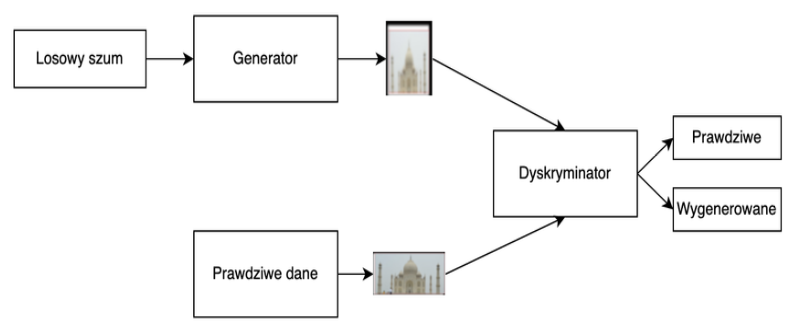
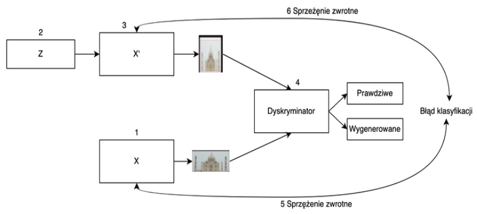

[Strona główna](../README.md)
# Generatywne sieci antagonistyczne
Generatywne sieci antagonistyczne (ang. generative adversarial networks - GAN) jest to podejście zaproponowane przez Iana Goodfellowa w 2014 roku.
Yann LeCun jeden z ojców konwolucyjnych sieci neuronowych (CNN) opisał sieci GAN jako najciekawszy pomysł dekady w dziedzinie uczenia maszynowego.
Należą one do grupy modeli generatywnych, które jako dane wejściowe przyjmują prostą zmienną losową zwracając zmienną losową, która podąża za bardziej złożonym rozkładem docelowym.
Polegają na zestawieniu ze sobą dwóch sieci neuronowych, które rywalizują ze sobą w sensie teorii gier w grze o sumie zerowej

GAN jest złożone z dwóch głębokich sieci neuronowych:
* Generator – jego celem jest generowanie danych o rozkładzie bardzo
podobnym do rozkładu danych szkoleniowych [38]. Musi on generować dane w taki sposób, aby dyskryminator nie mógł rozróżnić ich od danych rzeczywistych.
* Dyskryminator – dostaje dwa rodzaje danych wejściowych. Jedne pochodzą
od generatora, a inne z zestawu danych treningowych. Jego celem jest wskazanie, z którego z tych dwóch zestawów pochodzą dane wejściowe.

Krokowy opis działania generatywnej sieci antagonistycznej na podstawie powyższego schematu:
1. Wytrenowanie dyskryminatora na podstawie rzeczywistych danych z zestawu
treningowego.
2. Utworzenie losowego szumu jako wejścia do generatora. Szum może również być
utworzony na podstawie danych z zestawu treningowego.
3. Generator na podstawie dostarczonego szumu próbuje wygenerować dane, które
oszukają dyskryminator.
4. Dyskryminator klasyfikuje dane otrzymane z dwóch źródeł jako fałszywe lub
rzeczywiste, a następnie obliczany jest błąd klasyfikacji.
5. Błąd klasyfikacji propagowany jest do dyskryminatora w celu zaktualizowania
jego wag.
6. Błąd klasyfikacji propagowany jest do generatora w celu zaktualizowania jego
wag.
Z punktu widzenia teorii gier mamy do czynienia z grą dla dwóch graczy, w której stanem równowagi określilibyśmy sytuację, gdzie generator potrafi wytwarzać dane z rozkładem pokrywającym się z rozkładem danych treningowych, a dyskryminator ze względu nabrak możliwości rozróżnienia danych prawdziwych od wygenerowanych odpowiada z prawdopodobieństwem równym 1⁄2 dla dowolnego otrzymanego przykładu.
