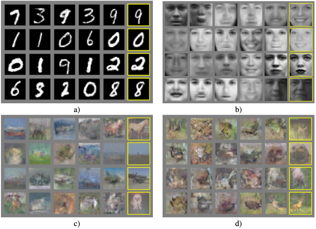
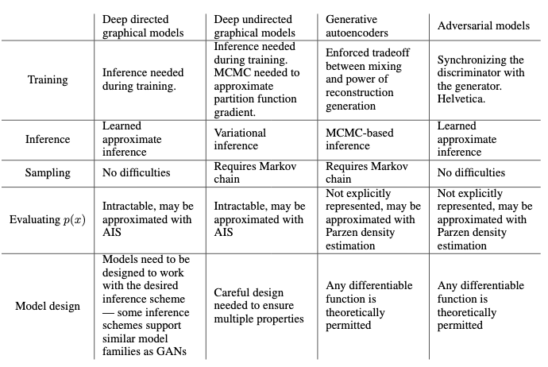

[Strona główna](../README.md)
# [[2014] Ian Goodfellow - Generative Adversarial Nets](https://papers.nips.cc/paper/2014/file/5ca3e9b122f61f8f06494c97b1afccf3-Paper.pdf)

## Abstrakt
Jest to pierwsza praca opisująca sieci GAN. Ian Goodfellow zaproponował nową strukturę dla modeli generatywnych, która eliminuje pewne wady wcześniej stosowanych modeli generatywnych.
Koncepcja polega na zestawieniu ze sobą dwóch modeli: Generatora (G) i Dyskryminatora (D). Generator ma za zadanie odwzorować rozkład danych szkoleniowych, a dyskryminator szacuje prawdopodobieństwo, że dana próbka pochodzi z zestawu treningowego, a nie z generatora.
Struktura ta odpowiada dwuosobowej grze typu minmax. Dzięki zastosowaniu wielowarstwowych perceptronów (głębokich sieci neuronowych) całą strukturę można trenować przy pomocy propagacji wstecznej bez potrzeby stosowania łańcuchów Markova ani 'unrolled approximate inference networks'(?).
Eksperymenty przedstawione w pracy pokazują potencjał zaproponowanej struktury poprzez jakościową i ilościową ocenę wygenerowanych próbek.

## Wstęp
Głębokie uczenie maszynowe osiągnęło wiele sukcesów w modelach dyskryminatywnych. Miały jednak mniejszy wpływ w kontekscie modeli generatywnych ze względu na wiele (wymienionych tam) trudności.
Praca przedstawia nową strukturę, która pozwala ominąć te trudności. W proponowanym modelu sieci GAN mamy model dyskryminatywny, który uczy się określać, czy próbka pochodzi z rozkładu danych treningowych, czy z rozkładu modelu genenratora.
Model generatywny natomiast jest tam porównany do zespołu fałszerzy, którzy próbują wyprodukować fałszywą walutę i używać jej bez wykrycia, natomiast model dyskryminatora jest analogiczny do policji, próbującej wykryć fałszywą walutę.
Konkurencja w tej grze zmusza oba zespoły do doskonalenia swoich metod aż do momentu, gdy podróbki nie będą odróżnialne od oryginalnych artykułów. 
Przedstawiony w artykule model generatora i dyskryminatora są wielowarstwowymi perceptronami (głębokimi sieciami neuronowymi). Do treningu użyte są algorytmy wstecznej propagacji oraz dropout, a próbkowanie z modelu generatora jest wykonywane poprzez przepuszczanie przez niego losowego szumu dzięki propagacji w przód.

## Eksperymenty
Do eksperymentów użyto następujących zbiorów danych:
* MNIST
* Torronto Face Database
* CIFAR-10

  
*Wizualizacja próbek z modelu. Kolumna po prawej stronie przedstawia najbliższy przykład uczący do sąsiedniej próby, aby wykazać, że model nie zapamiętał zbioru uczącego*

## Wady i zalety
* Wady
    * Brak sprecyzowanej reprezentacji pg(x)
    * Dyskryminator musi być dobrze zsynchronizowany z generatorem podczas treningu. Generator nie może być długo trenowany bez aktualizacji dyskryminatora, by uniknąć tzw. "Helvetica scenario", w którym generator 'zwija' zbyt wiele wartości /z/ do tej samej wartości /x/ i nie pozwala osiągnąć wystarczającej różnorodności w generowaniu danych
* Zalety
    * Nie wymaga użycia łańcuchów Markova. Do uzyskania gradientów wykorzystana jest propagacja wsteczna.
    * Podczas procesu uczenia nie jest potrzebne wnioskowanie (?)
    * Do modelu można włączyć szeroką gammę funkcji.
    * W poniższej tabeli porównano sieci GAN z innymi modelami generatywnymi. Zalety mają przede wszystkim charakter obliczeniowy.
    * Mogą one reprezentować bardzo ostre, a nawet zdegenerowane(?) rozkłady, podczas gdy metody oparte na łańcuchach Markova wymagają aby rozkład był rozmyty
    * Sieć generatora nie jest aktualizowana bezpośrednio z danych treningowych, a z gradientu przepływającego przez dyskryminator, przez co parametry generatora nie są bezpośrednim odwzorowaniem danych treningowych
    
  
*Wyzwania w modelowaniu generatywnym: podsumowanie trudności napotykanych przez różne podejścia do głębokiego modelowania generatywnego*

## Wnioski i dalsze prace
Przedstawiona struktura daje możliwość wielu rozszerzeń:
1. Warunkowy model generatywny p(x|c) (ang. Conditional generative model) (+ pomysł jak to zrobić)
1. Wyuczone wnioskowanie przybliżone(?) (ang. Learned approximate inference) (+ pomysł jak to zrobić)
1. Można użyć sieci antagonistycznych do zaimplementowania stochastycznego rozszerzenia dla deterministycznych MP-DBM (Multi-prediction deep Boltzmann machines)(?)
1. Można poprawić wydajność generatora lub dyskryminatora dzięki uczeniu częściowo nadzorowanemu (ang. Semi-supervised learning)
1. Można przyśpieszyć proces trenowania opracowując lepsze metody koordynacji dyskryminatora i generatora lub określając lepsze rozkłady próbki (z) dostarczanej do generatora.
