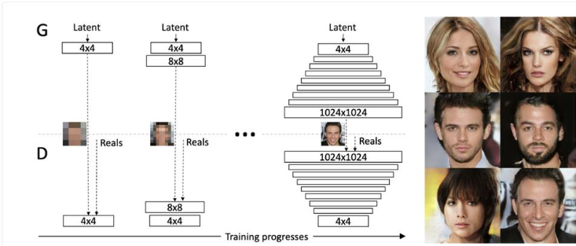
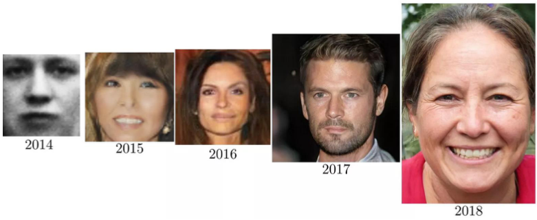

[Strona główna](../README.md)
# Progressive GAN
Tero Karras w 2017r. w pracy „Progressive Growing of GANs for Improved Quality, Stability, and Variation” [1] zaproponował metodę uczenia sieci GAN.
Polegała ona na ciągłym ulepszaniu generatora i dyskryminatora podczas trenowania.
Opisana metoda dotyczyła generowania zdjęć i proponowała, by rozpocząć trenowanie sieci od zdjęć o niskiej rozdzielczości, a następnie stopniowe jej zwiększanie, gdy generator zaczyna uzyskiwać zadawalające efekty.
Zmiana rozdzielczości podczas trenowania była osiągana poprzez dodawanie do sieci kolejnych warstw. Dzięki zastosowaniu takiego przyrostowego podejścia proces uczenia odkrywał początkowo wielkoskalowe struktury rozkładu obrazu, by następnie przechodzić do coraz większych szczegółów.

  
*Metoda przyrostowego trenowania sieci GAN [1]*

Pomysł ten był swego rodzaju kamieniem milowym w rozwoju sieci GAN. Pozwoliło to na generowanie bardzo realistycznych obrazów w wysokich rozdzielczościach, a także od 2 do 6-krotnie skróciło czas trenowania.

  
*Postęp w generowaniu realistycznych twarzy [2]*

## Źródła
* [[1] T. Karras, „Progressive Growing of GANs for Improved Quality, Stability, and Variation,”](https://arxiv.org/abs/1710.10196)
* [[2] These fake images tell a scary story of how far AI has come](https://www.vox.com/future-perfect/2019/5/31/18645993/ai-deepfakes-gan-explained-machine-learning)

